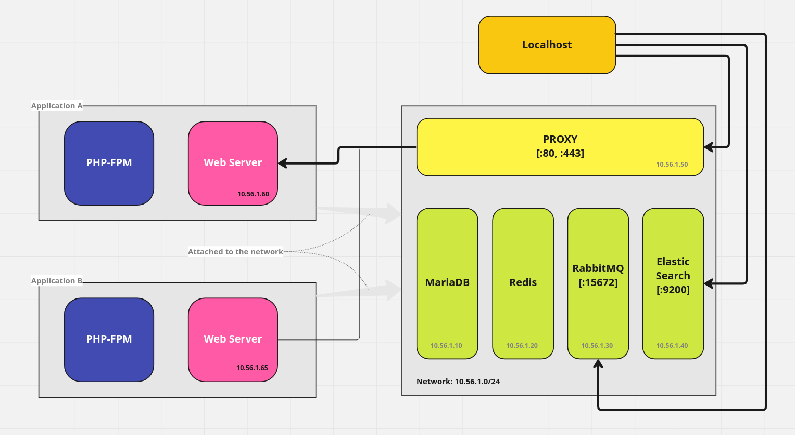
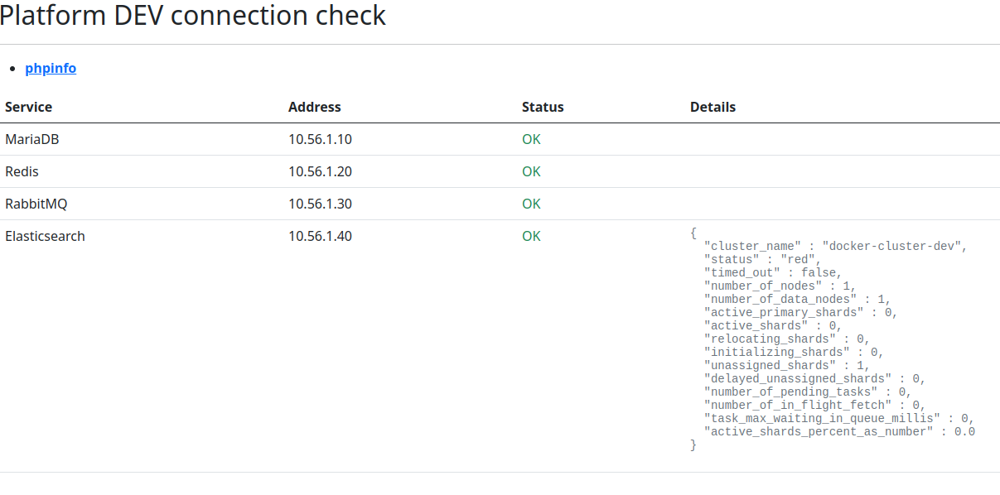

# Dockerized dev platform for PHP projects


---


## Why do I need this dev platform


Because you want to focus on developing and you do not want to fight with the environment (especially if you work in a team).


Docker containers make it easy to put new versions of software, with new business features, into your stack quickly—and to quickly roll back to a previous version if you need to.


Everything looks nice and great if you need to run a single application. For example, you can download a predefined docker-compose file for Wordpress which will download, configure and run a bunch of required containers with web server, PHP, database and so on.


The problem appears when you need to execute another one blog on the same machine. Then the other app will run another web server, the other PHP instance and next database server. The same situation is when we want to develop a microservices application when we need a few "separate" applications which can communicate with each other.
As you can see it's not the best way for using our resources especially when we develop a few applications.


To solve this issue I've built this Dev Platform.


Current version creates a common platform with basic required services like one relational database, some cache layer (redis for example), one elasticsearch instance and so on.
All these services are shared between all developed applications, but it doesn't contain PHP & webserver.


PHP & Nginx/Apache are the parts which need to be configured in the project you are working on. So you can keep the php version as you like for the specified project and the only thing you need to do is to expose a port for the container which runs your application.


Dev Platform has built-on the proxy which will route 1..n your web services and map them on the one port on your localhost.


So in another repo I delivered an addition, for proper work, you need to use an extra package which will dockerize your application and what should make things easier.


The main schema how dev platform works is presented on the pic below:




## Available services:


In current version `Dev Platform` delivery services like:


- mariadb v10.8
- redis v7.0.8
- rabbitmq v3.11.9
- elasticsearch v8.6.1
- proxy built on Nginx v1.23.3


## Installation


- Make sure Docker is installed on your machine.
- Download the version of this repository.
- run command `docker-compose up -d`

... wait a few sec then try to open in your browser below url:

```html
http://localhost/status/
```

If you waited a few sec and all services started successfully you should see such pic:  



If you see it than you are ready to configure your first app in `Dev Platform`

## Network 

`Dev Platform` creates a separate network on your machine where all executed services are attached to. In other words all services can communicate with each other. You can see in the picture above, the status website displays all required information about running services and their proper IP addresses.

Additionally, ports marked as `[:...]` have been mapped into your local machine so you can easily get access to RabbitMQ admin panel or even ElasticSearch.

Customization
Dockerized uses Docker Compose to run commands, which are defined in a Compose File. The default services are listed in docker-compose.yml. You can also add your own services or customize the defaults, by loading a custom Compose File.

Additionally, part of the configurable variables are stored in .env file so feel free to update them.


## Customization


Dockerized uses Docker Compose to run commands, which are defined in a Compose File. The default services are listed in docker-compose.yml. You can also add your own services or customize the defaults, by loading a custom Compose File.


Additionally, part of the configurable variables are stored in the .env file so feel free to update this file.


### How to add a new application to the platform
...


### How to add a new virtualhost in the platform
...
